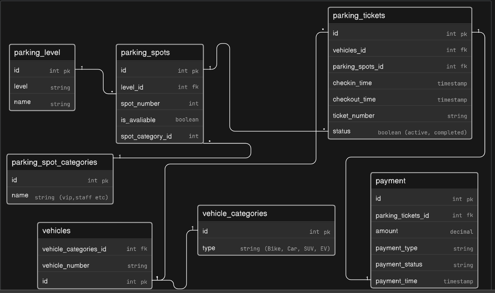

# Comic-Con India Parking Management System

## Overview

This database design is for **Comic-Con India** parking facility management system. The venue has a structured parking facility divided into multiple zones and levels, accommodating different vehicle types including bikes, cars, SUVs, cabs, and EV vehicles.

### Key Features

- Multiple parking zones and levels
- Reserved areas for cosplayers with props, exhibitors, creators, VIP guests, staff members, and EV charging vehicles
- Automated ticket generation based on vehicle type and availability
- Dynamic parking fee calculation based on parking duration

## System Workflow

1. **Vehicle Entry**: When a vehicle enters the parking facility, the system generates a parking ticket and assigns a suitable parking spot depending on vehicle type and availability
2. **Vehicle Exit**: When the vehicle exits, the system records exit time and calculates the parking fee

## Database Schema

### vehicle_categories

Defines different types of vehicles

| Column | Type   | Constraint                 |
| ------ | ------ | -------------------------- |
| id     | int    | Primary Key                |
| type   | string | Values: Bike, Car, SUV, EV |

### vehicles

Stores vehicle information

| Column                | Type   | Constraint                       |
| --------------------- | ------ | -------------------------------- |
| id                    | int    | Primary Key                      |
| vehicle_number        | string | -                                |
| vehicle_categories_id | int    | Foreign Key → vehicle_categories |

### parking_level

Represents parking facility levels

| Column | Type   | Constraint  |
| ------ | ------ | ----------- |
| id     | int    | Primary Key |
| level  | string | -           |
| name   | string | -           |

### parking_spot_categories

Categorizes parking spots by type

| Column | Type   | Constraint               |
| ------ | ------ | ------------------------ |
| id     | int    | Primary Key              |
| name   | string | Values: VIP, Staff, etc. |

### parking_spots

Individual parking spots with availability status

| Column           | Type    | Constraint                            |
| ---------------- | ------- | ------------------------------------- |
| id               | int     | Primary Key                           |
| level_id         | int     | Foreign Key → parking_level           |
| spot_number      | int     | -                                     |
| spot_category_id | int     | Foreign Key → parking_spot_categories |
| is_available     | boolean | -                                     |

### parking_tickets

Records vehicle parking transactions

| Column           | Type      | Constraint                  |
| ---------------- | --------- | --------------------------- |
| id               | int       | Primary Key                 |
| vehicles_id      | int       | Foreign Key → vehicles      |
| parking_spots_id | int       | Foreign Key → parking_spots |
| checkin_time     | timestamp | -                           |
| checkout_time    | timestamp | -                           |
| ticket_number    | string    | -                           |
| status           | boolean   | Values: active, completed   |

### payment

Records payment transactions for parking

| Column             | Type      | Constraint                    |
| ------------------ | --------- | ----------------------------- |
| id                 | int       | Primary Key                   |
| parking_tickets_id | int       | Foreign Key → parking_tickets |
| amount             | decimal   | -                             |
| payment_type       | string    | -                             |
| payment_status     | string    | -                             |
| payment_time       | timestamp | -                             |

## Relationships

```
vehicles.vehicle_categories_id → vehicle_categories.id
parking_spots.spot_category_id → parking_spot_categories.id
parking_level.id ← parking_spots.level_id
parking_spots.id ← parking_tickets.parking_spots_id
parking_tickets.id → payment.parking_tickets_id
vehicles.id ← parking_tickets.vehicles_id
```
ER-Diagram:
