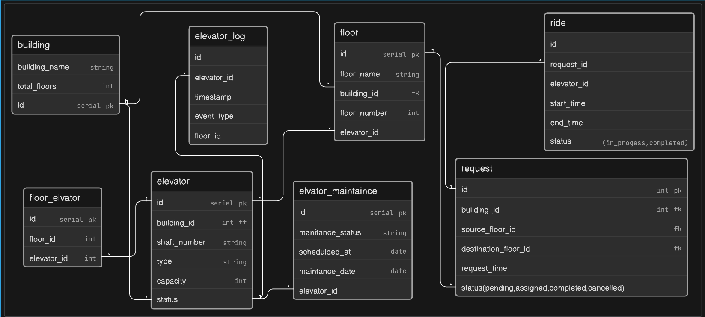

# Smart Elevator Control System

## Overview

LiftGrid Systems is a fast-growing infrastructure technology company that builds intelligent elevator control platforms for large commercial buildings across India.

Their software is used in corporate towers, malls, airports, hospitals, and high-rise residential complexes where dozens of elevators operate together across many floors.

### System Requirements

Unlike small standalone lifts, these buildings run multiple elevators per building, grouped into zones, handling thousands of passengers daily. The system must manage elevator assignments, floor requests, maintenance tracking, and ride logs efficiently.

Each building can contain multiple elevator shafts. Each shaft contains one elevator. Each elevator moves across a defined set of floors and responds to ride requests generated by users from different floors.

## Database Schema

### Tables

#### building

```
id                serial (primary key)
building_name     string
total_floors      int
```

#### floor

```
id                serial (primary key)
floor_name        string
building_id       foreign key
floor_number      int
```

#### elevator

```
id                serial (primary key)
building_id       int (foreign key)
shaft_number      string
type              string
capacity          int
status            string (idle, moving, maintenance, offline)
```

#### floor_elevator

```
id                serial (primary key)
floor_id          int
elevator_id       int
```

#### request

```
id                int (primary key)
building_id       int (foreign key)
source_floor_id   foreign key
destination_floor_id  foreign key
request_time      timestamp
status            string (pending, assigned, completed, cancelled)
```

#### ride

```
id                serial (primary key)
request_id        foreign key
elevator_id       foreign key
start_time        timestamp
end_time          timestamp
status            string (in_progress, completed)
```

#### elevator_maintenance

```
id                serial (primary key)
maintenance_status  string
scheduled_at      date
maintenance_date  date
elevator_id       foreign key
```

#### elevator_log

```
id                serial (primary key)
elevator_id       foreign key
timestamp         timestamp
event_type        string
floor_id          foreign key
```

## Relationships

- `building.id` → `floor.building_id` (one building has many floors)
- `building.id` → `elevator.building_id` (one building has many elevators)
- `elevator.id` ↔ `floor_elevator.elevator_id` (many-to-many: elevator serves multiple floors)
- `floor.id` → `request.source_floor_id` (requests originate from floors)
- `request.id` → `ride.request_id` (one request can have one ride)
- `elevator.id` → `elevator_maintenance.elevator_id` (elevator has many maintenance records)
- `elevator.id` → `elevator_log.elevator_id` (elevator generates many log entries)

